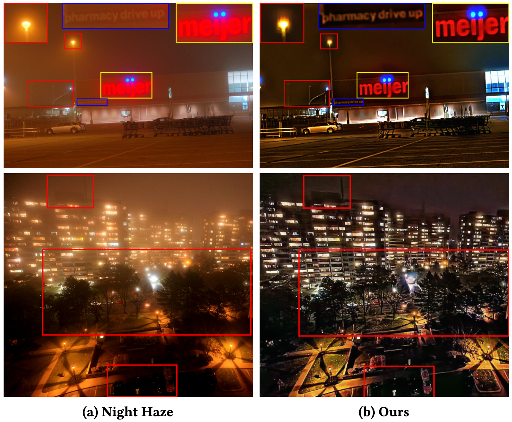
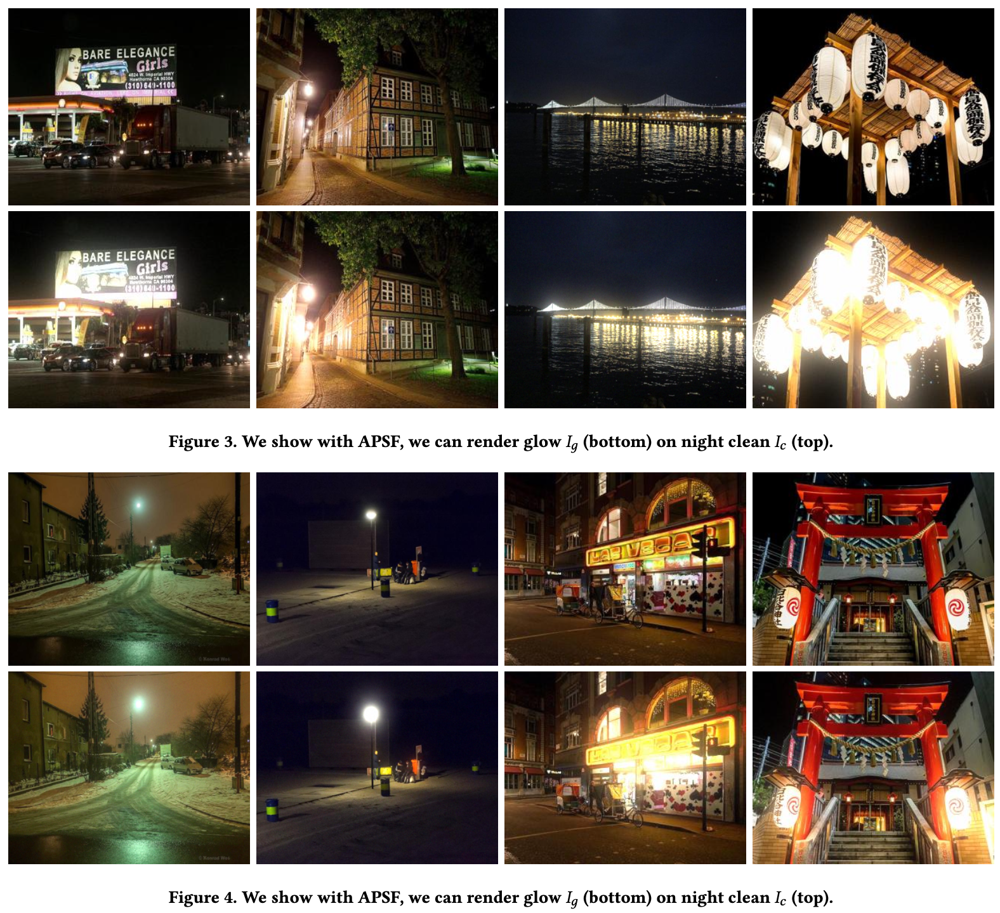
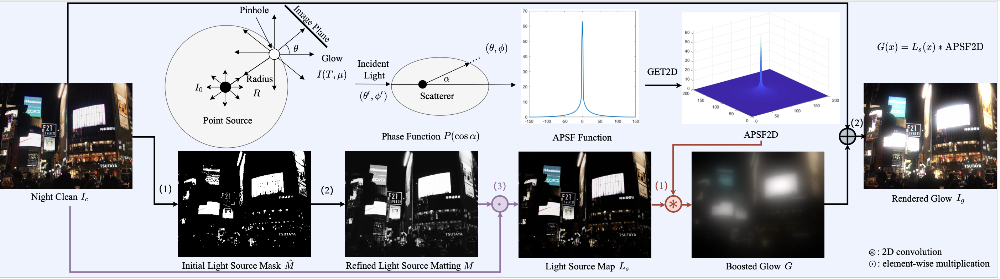
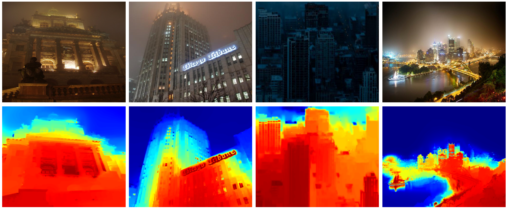
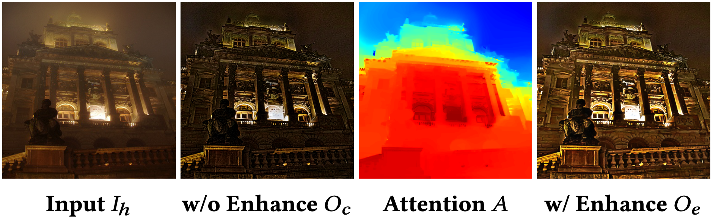

# nighttime_dehaze (ACMMM'2023)

## Introduction
> [Enhancing Visibility in Nighttime Haze Images Using Guided APSF and Gradient Adaptive Convolution](https://arxiv.org/abs/2308.01738)\
> ACM International Conference on Multimedia (`ACMMM2023`)\
>[Yeying Jin](https://jinyeying.github.io/), [Beibei Lin](https://bb12346.github.io/), Wending Yan, Yuan Yuan, Wei Ye, and [Robby T. Tan](https://tanrobby.github.io/pub.html)

>[](https://arxiv.org/abs/2308.01738)
>[[Paper]](https://dl.acm.org/doi/10.1145/3581783.3611884)

## Prerequisites
```
git clone https://github.com/jinyeying/nighttime_dehaze.git
cd nighttime_dehaze/
conda create -n dehaze python=3.7
conda activate dehaze
conda install pytorch=1.10.2 torchvision torchaudio cudatoolkit=11.3 -c pytorch
python3 -m pip install scipy==1.7.3
python3 -m pip install opencv-python==4.4.0.46
```

## Nighttime Haze Data
| Data                | Dropbox                                                                             | BaiduPan                                                                     | Number & Type|
| :-----------------: | :---------------------------------------------------------------------------------: | :--------------------------------------------------------------------------: |:-----: | 
|RealNightHaze        |[Dropbox](https://www.dropbox.com/sh/7qzmb3y9akejape/AABYf2ZAqn_5vmPsOPg7KqoMa?dl=0) |[BaiduPan](https://pan.baidu.com/s/11NFB-XXT4SEZcz0eFEajbg?pwd=r5mi) code:r5mi|443, Haze|
|Internet_night_clean1|[Dropbox](https://www.dropbox.com/sh/izex781w18efhqm/AACu8RJsyRVGNOVVTt3X-0HDa?dl=0) |[BaiduPan](https://pan.baidu.com/s/1km6GO_RPI3jVBlpAZECi0g?pwd=m7k1) code:m7k1|411, Clean Reference|
|Internet_night_clean2|[Dropbox](https://www.dropbox.com/sh/yj0jac9alsfrxzx/AACsDWYljCjHuFAQ4X1HCNcva?dl=0) |[BaiduPan](https://pan.baidu.com/s/1_Vt5T3m04xqvM9WiKMRuXw?pwd=8f13) code:8f13|50, Clean Reference|
|GTA5 nighttime fog   |[Dropbox](https://www.dropbox.com/sh/gfw44ttcu5czrbg/AACr2GZWvAdwYPV0wgs7s00xa?dl=0) |[BaiduPan](https://pan.baidu.com/s/1hW9wfVhvYbRaUdHbozOPbw?pwd=67ml) code:67ml|Train:787,Test:77, Synthetic|

Synthetic Nighttime Haze and Clean Ground Truth 
* `ECCV2020`
*Nighttime Defogging Using High-Low Frequency Decomposition and Grayscale-Color Networks* [[Paper]](https://www.ecva.net/papers/eccv_2020/papers_ECCV/papers/123570460.pdf)\
Wending Yan, [Robby T. Tan](https://tanrobby.github.io/pub.html) and [Dengxin Dai](https://vas.mpi-inf.mpg.de/)

## Nighttime Dehazing Results [Dropbox](https://www.dropbox.com/sh/itopl02tpv1sda9/AABx1QJVtA9wbPoNVU65r584a?dl=0) | [BaiduPan](https://pan.baidu.com/s/1RpMKNZOAmN9l2s3svsdAFg?pwd=oovt) code:oovt
| Model  | Dropbox | BaiduPan | Model Put in Path| Results Dropbox | Results BaiduPan |
| :----: | :-----: | :------: |:---------------: |:--------------: | :--------------: | 
|dehaze.pt|[dehaze.pt](https://www.dropbox.com/scl/fi/y634lpwli4u8dosn0o28r/dehaze.pt?rlkey=lmz1yjlga39somlfr6s0618q8&dl=0)|[dehaze.pt](https://pan.baidu.com/s/1x0Enz-5wXC4Tzm-RXUTmlQ?pwd=n3t8) code:n3t8|[results/dehaze/model](https://github.com/jinyeying/nighttime_dehaze/tree/main/results/dehaze/model)|[RealNightHaze]()|[RealNightHaze](https://pan.baidu.com/s/1LzmygaqvkBtTihJ8sA-amQ?pwd=i43f) code:i43f|
|GTA5.pt|[GTA5.pt](https://www.dropbox.com/scl/fi/vencyhexni03379iht5yw/GTA5.pt?rlkey=oxsx81g0ds0xk085v2uglkr3t&dl=0)|[GTA5.pt](https://pan.baidu.com/s/1riTgeD1qD09S2Z0Q3niOHw?pwd=fk29) code:fk29|[results/GTA5/model](https://github.com/jinyeying/nighttime_dehaze/tree/main/results/GTA5/model)|[GTA5](https://www.dropbox.com/scl/fo/xik6x6it9f0g5o0n2ng3j/AEBhoSbQ3_z7QSTSSE1G4po?rlkey=mtooznpivfcam7moy9l5skxo8&st=4m470glv&dl=0)|[GTA5](https://pan.baidu.com/s/1diN_A71KJEvlGL0AvlmXDg?pwd=ufen) code:ufen|
|NHR.pt|[NHR.pt](https://www.dropbox.com/scl/fi/g6gzmjz6eynjqq02lksk0/NHR.pt?rlkey=61o5mck5zrracxoipbdfmmokx&dl=0)|[NHR.pt](https://pan.baidu.com/s/15ejj67FY604Bmr8fjXZADA?pwd=dnhf) code:dnhf|[results/NHR/model](https://github.com/jinyeying/nighttime_dehaze/tree/main/results/NHR/model)|[NHR](https://www.dropbox.com/scl/fo/6w9tuw272ie4gsrxrjjry/ANgjsTO1llXkpwqj2-h7Y-I?rlkey=5pi3kbxkexqatdmfh0sfla9jv&st=dxyaddzl&dl=0)|[NHR](https://pan.baidu.com/s/1lRH6-L4_bEstpa4Opx30Cw?pwd=0nma) code:0nma|
|NHM.pt|[NHM.pt](https://www.dropbox.com/scl/fi/bncvz68qrhakq0ws2un4w/NHM.pt?rlkey=rowzho61jyn06v2q5gxj8c7jw&dl=0)|[NHM.pt](https://pan.baidu.com/s/1HovU31unlvanTWoEG2hD5g?pwd=d7oj) code:d7oj|[results/NHM/model](https://github.com/jinyeying/nighttime_dehaze/tree/main/results/NHM/model)|[NHM](https://www.dropbox.com/scl/fo/nxxykvzws9my0zea7a8a6/AHnXpO95Lfdao65yPtnQ7hQ?rlkey=z729eo0t41ab1jbepu8qi1iih&st=1afq8q0l&dl=0)|[NHM](https://pan.baidu.com/s/19DAbafWi0IrmDg22XdMTRQ?pwd=4gt0) code：4gt0|
|NHC.pt|[NHC.pt](https://www.dropbox.com/scl/fi/899sug9o9cwrjdxx61raa/NHC.pt?rlkey=e7vye94mbgut8oicp1yl3kuva&dl=0)|[NHC.pt](https://pan.baidu.com/s/1Tyi7NJ4aMaIaoehh7Hv77g?pwd=yryp) code:yryp|[results/NHC/model](https://github.com/jinyeying/nighttime_dehaze/tree/main/results/NHC/model)|[NHC](https://www.dropbox.com/scl/fo/so9ppeu571zgtoz6gxxpx/ABBkrS8A8nQRKjdCUQr7FU0?rlkey=dn02ite66xu0encwshayhz2ka&st=26d34esu&dl=0)|[NHC](https://pan.baidu.com/s/1nOrVdvMWGpuUjLBhGN3XBA?pwd=njf9) code：njf9|

We provide the visualization results in `0_ACMMM23_RESULTS/NHR/index.html`, <br>
inside the directory `0_ACMMM23_RESULTS/NHR/img_0/` are hazy inputs, `img_1` are ground truths, `img_2` are our results. <br>
For results corresponding to `GTA5`, `NHM` or `NHC`, please refer to the respective directories.

* For the RealNightHaze Dataset
1. Set the `datasetpath` to `RealNightHaze`,
2. Download the checkpoint dehaze.pt [Dropbox](https://www.dropbox.com/scl/fi/y634lpwli4u8dosn0o28r/dehaze.pt?rlkey=lmz1yjlga39somlfr6s0618q8&dl=0)| [BaiduPan](https://pan.baidu.com/s/1x0Enz-5wXC4Tzm-RXUTmlQ?pwd=n3t8) code:n3t8 put in [results/dehaze/model](https://github.com/jinyeying/nighttime_dehaze/tree/main/results/dehaze/model),
3. Run the [Python code](https://github.com/jinyeying/nighttime_dehaze/blob/main/main_test.py), results are in [results/dehaze/output](https://github.com/jinyeying/nighttime_dehaze/tree/main/results/dehaze/output).
```
CUDA_VISIBLE_DEVICES=1 python main_test.py --dataset dehaze --datasetpath /diskc/yeying/night_dehaze/dataset/Internet_night_fog/
```
<p align="left">
  
</p>

* For the Synthetic Dataset
1. Set `Line18 --have_gt` to `True`, set the `datasetpath` to `GTA5` or `NHR` or `NHM` or `NHC`,
2. Download the checkpoint [GTA5.pt](https://www.dropbox.com/scl/fi/vencyhexni03379iht5yw/GTA5.pt?rlkey=oxsx81g0ds0xk085v2uglkr3t&dl=0), put in [results/GTA5/model](https://github.com/jinyeying/nighttime_dehaze/tree/main/results/GTA5/model).
Similarly, for [NHR.pt](https://www.dropbox.com/scl/fi/g6gzmjz6eynjqq02lksk0/NHR.pt?rlkey=61o5mck5zrracxoipbdfmmokx&dl=0), [NHM.pt](https://www.dropbox.com/scl/fi/bncvz68qrhakq0ws2un4w/NHM.pt?rlkey=rowzho61jyn06v2q5gxj8c7jw&dl=0), [NHC.pt](https://www.dropbox.com/scl/fi/899sug9o9cwrjdxx61raa/NHC.pt?rlkey=e7vye94mbgut8oicp1yl3kuva&dl=0),
3. Run the [Python code](https://github.com/jinyeying/nighttime_dehaze/blob/main/main_test.py),
```
CUDA_VISIBLE_DEVICES=1 python main_test.py --dataset NHM --datasetpath /diskc/yeying/night_dehaze/dataset/middlebury/testA/ 
CUDA_VISIBLE_DEVICES=1 python main_test.py --dataset NHC --datasetpath /diskc/yeying/night_dehaze/dataset/Cityscape/testA/ 
CUDA_VISIBLE_DEVICES=1 python main_test.py --dataset NHR --datasetpath /diskc/yeying/night_dehaze/dataset/NHR/testA/ 
CUDA_VISIBLE_DEVICES=1 python main_test.py --dataset GTA5 --datasetpath /diskc/yeying/night_dehaze/GTA5/testA/
```

* Evaluation: 
Set the dataset_name `GTA5` or `NHR` or `NHM` or `NHC`, and run the [Python code](https://github.com/jinyeying/nighttime_dehaze/blob/main/0_ACMMM23_RESULTS/calculate_psnr_ssim_NH_GTA5.py):
```
python calculate_psnr_ssim_NH_GTA5.py
```
| Dataset | PSNR | SSIM | 
|--------|------|------ |
| GTA5| **30.383** |**0.9042**|
| NHR | **26.56** |**0.89**|
| NHM | **33.76** |**0.92**|
| NHC | **38.86** |**0.97**|

## APSF-Guided Nighttime Glow Rendering
Run the [Matlab code](https://github.com/jinyeying/nighttime_dehaze/blob/main/APSF_GLOW_RENDER_CODE/synthetic_glow_pairs.m) to obtain the clean and glow pairs:
```
APSF_GLOW_RENDER_CODE/synthetic_glow_pairs.m
````
Change the datapath `nighttime_dehaze/paired_data/clean_data/`, <br>
the `paired clean and glow results` are saved in [nighttime_dehaze/paired_data/clean/](https://github.com/jinyeying/nighttime_dehaze/tree/main/paired_data/clean) and [nighttime_dehaze/paired_data/glow/](https://github.com/jinyeying/nighttime_dehaze/tree/main/paired_data/glow), <br>
the visualization of `light source maps` are in [nighttime_dehaze/paired_data/glow_render_visual/light_source/](https://github.com/jinyeying/nighttime_dehaze/tree/main/paired_data/glow_render_visual/light_source).

<p align="left">
  
</p>
<p align="left">
  
</p>

Run the [Matlab code](https://github.com/jinyeying/nighttime_dehaze/blob/main/APSF_GLOW_RENDER_CODE/synthetic_glow_fig3_visualization.m) to visualize Fig.3 in the main paper:
```
APSF_GLOW_RENDER_CODE/synthetic_glow_fig3_visualization.m
```
<p align="left">
  
</p>

APSF and Alpha Matting are the implementations of the papers:<br>
* `CVPR03`
*Shedding Light on the Weather* [[Paper](https://cave.cs.columbia.edu/old/publications/pdfs/Narasimhan_CVPR03.pdf)]
* `CVPR06`
*A Closed-Form Solution to Natural Image Matting* [[Paper](https://people.csail.mit.edu/alevin/papers/Matting-Levin-Lischinski-Weiss-CVPR06.pdf)]

## Edge
Run the [Python code](https://github.com/jinyeying/nighttime_dehaze/blob/main/EDGE/main.py) to visualize Fig.6, the environment is Pytorch 1.9 with cuda 10.1 and cudnn 7.5, results are in [EDGE/results](https://github.com/jinyeying/nighttime_dehaze/tree/main/EDGE/results).
```
conda install pytorch==1.9.0 torchvision==0.10.0 torchaudio==0.9.0 cudatoolkit=10.1 -c pytorch
```
```
python main.py --sa --dil --gpu 1 --datadir ./Input/ --evaluate-converted
```
<p align="left">
  
</p>

## Enhancement
Run the [Matlab code](https://github.com/jinyeying/nighttime_dehaze/blob/main/ENHANCEMENT/get_texture_attention.m) to visualize Fig.8, results are in [ENHANCEMENT/attention_map](https://github.com/jinyeying/nighttime_dehaze/tree/main/ENHANCEMENT/attention_map).
<p align="left">
  
</p>

Run the [Matlab code](https://github.com/jinyeying/nighttime_dehaze/blob/main/ENHANCEMENT/get_fig10.m) to visualize Fig.10.
<p align="left">
  
</p>


## License
The code and models in this repository are licensed under the MIT License for academic and other non-commercial uses.<br>
For commercial use of the code and models, separate commercial licensing is available. Please contact:
- Yeying Jin (jinyeying@u.nus.edu)
- Robby T. Tan (tanrobby@gmail.com)
- Jonathan Tan (jonathan_tano@nus.edu.sg)

## Citation
If this work or the Internet data is useful for your research, please cite our paper. 
```BibTeX
@inproceedings{jin2023enhancing,
  title={Enhancing visibility in nighttime haze images using guided apsf and gradient adaptive convolution},
  author={Jin, Yeying and Lin, Beibei and Yan, Wending and Yuan, Yuan and Ye, Wei and Tan, Robby T},
  booktitle={Proceedings of the 31st ACM International Conference on Multimedia},
  pages={2446--2457},
  year={2023}
}

@inproceedings{jin2022unsupervised,
  title={Unsupervised night image enhancement: When layer decomposition meets light-effects suppression},
  author={Jin, Yeying and Yang, Wenhan and Tan, Robby T},
  booktitle={European Conference on Computer Vision},
  pages={404--421},
  year={2022},
  organization={Springer}
}
```


